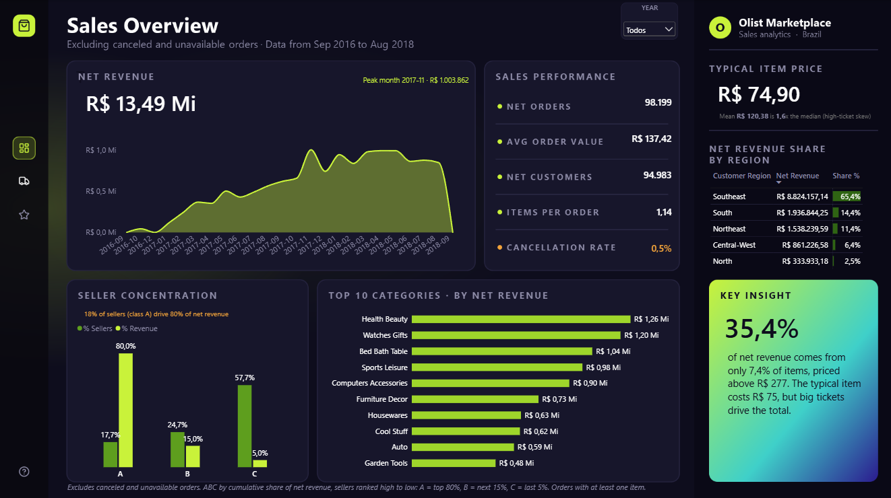
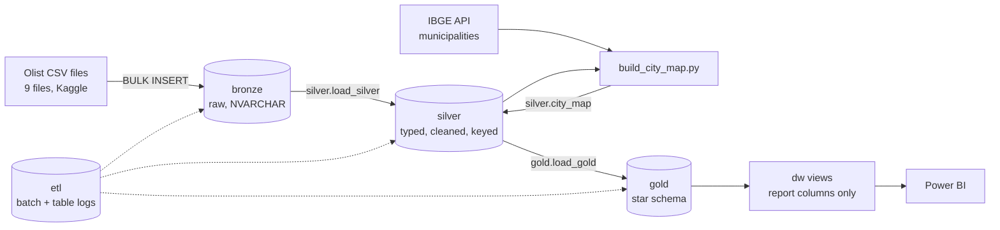
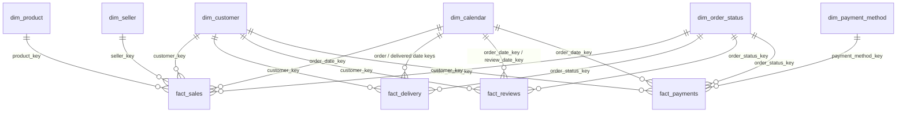
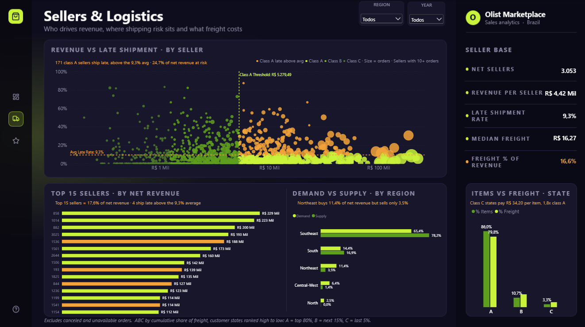
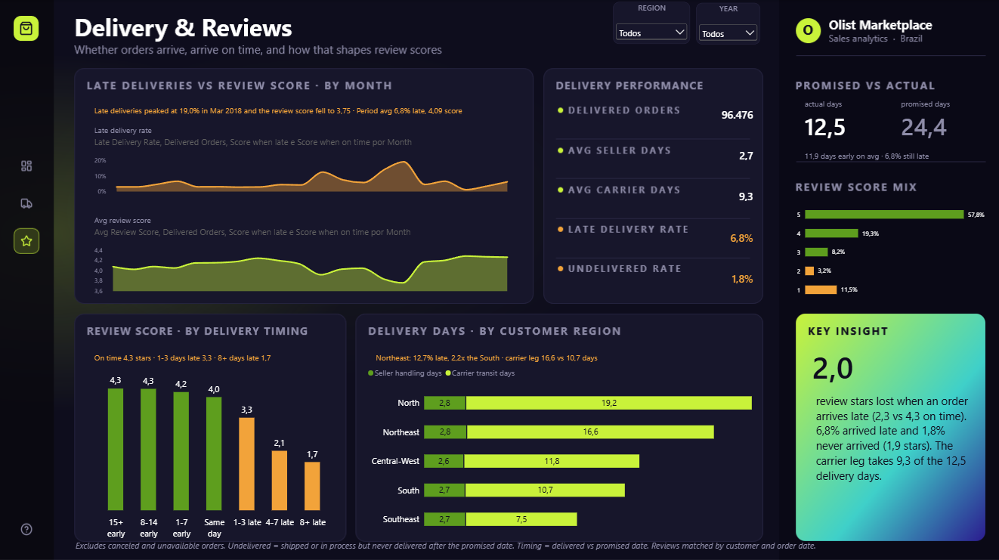

# Olist Data Warehouse

> SQL Server data warehouse for the [Brazilian E-Commerce Public Dataset by Olist](https://www.kaggle.com/datasets/olistbr/brazilian-ecommerce), built with the medallion architecture (bronze, silver, gold) and modeled as a star schema for Power BI.
> It includes ETL monitoring, automated data quality checks and a Python step that standardizes Brazilian city names against the official IBGE registry.

The dataset has about 100k orders placed between 2016 and 2018 on Olist, a marketplace that connects sellers to the main Brazilian e-commerce channels.

## Dashboard Preview



## Project Overview

The raw CSVs come with problems that block reliable reporting: untyped text, duplicated geolocation points, inconsistent city spellings and delivery dates spread across several columns. This project turns them into a clean, documented star schema that a Power BI report can read directly..

## Business Questions

The warehouse is modeled to answer:

- How do revenue, orders and average order value change over time?
- How concentrated is revenue among sellers (ABC / Pareto)?
- How much does freight cost, and which sellers and regions ship late?
- How often are orders delivered late, and how much do late deliveries lower review scores?

## Highlights

- **Medallion pipeline in T-SQL.** One stored procedure per layer, all idempotent. Every run is logged in 'etl.batch_log' and 'etl.table_load_log'.
- **Star schema.** 6 dimensions and 4 fact tables with integer surrogate keys, enforced foreign keys and 'yyyymmdd' date keys. Surrogate keys are deterministic: the same data always gets the same keys.
- **City name standardization.** Cities are typed by hand in the source. A rule-based matcher (exact, alias, spelling skeleton, Jaro-Winkler fuzzy match, zip-prefix fallback) maps **98.9%** of 15,249 city/state/zip combinations to an official IBGE municipality.
- **Data quality as code.** More than 70 checks across the three layers: row reconciliation, PK/FK integrity, domain and range rules, money totals reconciled, and date logic.
- **Thin BI layer.** Power BI reads from 'dw' views that expose only the columns the report uses.

## Architecture



| Layer | Purpose | Details |
|---|---|---|
| **bronze** | Raw landing zone, one table per CSV | All columns are 'NVARCHAR' and nullable, so values land without conversion errors |
| **silver** | Cleaned, typed and keyed data | Proper types and natural PKs; geolocation outliers removed; one median point per zip; delivery split into approval, seller handling and carrier transit; review sentiment |
| **gold** | Business-ready star schema | Surrogate keys, SCD type 1 dimensions, display-ready values |
| **dw** | Power BI interface | One view per model table, no business logic |
| **etl** | Observability | Batch and table load logs written by every procedure |

## Data Model (gold)



| Table | Grain | Rows |
|---|---|---:|
| `fact_sales` | one order item (one unit sold) | 112,650 |
| `fact_delivery` | one order (logistics stages, delay, late flag) | 99,441 |
| `fact_reviews` | one review | 99,224 |
| `fact_payments` | one payment of an order | 103,886 |
| `dim_customer` | one person ('customer_unique_id') | 96,096 |
| `dim_product` | one product | 32,951 |
| `dim_seller` | one seller | 3,095 |
| `dim_calendar` | one day, 2016-2018 | 1,096 |
| `dim_order_status` | one order status, keys in lifecycle order | 8 |
| `dim_payment_method` | one payment type | 5 |

Design decisions:

- **Facts relate only to dimensions.** Facts are never joined to each other. A shared integer 'order_key' lets Power BI count distinct orders without loading the 32-character 'order_id'.
- **Dimensions hold only their own attributes.** Activity metrics such as "orders per customer" belong in DAX measures, not in dimension columns.
- **Role-playing dates.** The purchase date is the active relationship in every fact, so reviews and deliveries line up with sales. The review and delivered dates are inactive relationships, and they require the use of 'USERELATIONSHIP'.
- **Known source errors are kept and documented, not hidden.** For example, 4 items have 2020 shipping deadlines on 2017 orders.

## Dashboard Pages

The report has three 3 pages, linked by a navigation bar. Each visual has a dynamic subtitle that states its takeaway for the current filters.

### Sales Overview


### Sellers & Logistics



### Delivery & Reviews



## Explore the Report
[View the Interactive Report](https://app.powerbi.com/links/j9xNISQAXy?ctid=8b6c959c-d7c4-406c-9e6b-cac0b71de24e&pbi_source=linkShare)

## Repository Structure

```
olist-dw-dashboard/
├── data/
│   └── ibge_municipalities.json   # cached IBGE reference (Olist CSVs are not committed)
├── screenshots/                   # dashboard page prints
├── sql/
│   ├── 00_init/                   # database, schemas, ETL monitoring tables and procedures
│   ├── bronze/                    # DDL + bronze.load_bronze
│   ├── silver/                    # DDL + silver.load_silver + IBGE city reference tables
│   ├── gold/                      # star schema DDL + gold.load_gold
│   ├── dw/                        # Power BI views
│   ├── analysis.sql               # exploratory analysis of the dw facts (read-only)
│   └── run_full_pipeline.sql      # runs bronze -> silver -> gold
├── src/
│   └── build_city_map.py          # IBGE city matching (pyodbc + rapidfuzz)
└── tests/
    ├── bronze_quality_checks.sql
    ├── silver_quality_checks.sql
    ├── gold_quality_checks.sql
    └── test_build_city_map.py     # unit tests for the matching rules
```

## Tools & Technologies

| Area | Tools |
|---|---|
| Database / ETL | SQL Server, T-SQL stored procedures, 'BULK INSERT' |
| Data enrichment | Python 3.11, pyodbc, rapidfuzz, IBGE public API |
| Testing | SQL quality check scripts, pytest |
| BI | Power BI, DAX |

## Data Sources

- Olist, [Brazilian E-Commerce Public Dataset](https://www.kaggle.com/datasets/olistbr/brazilian-ecommerce) (Kaggle 'olistbr/brazilian-ecommerce').
- IBGE, [Localidades API](https://servicodados.ibge.gov.br/api/docs/localidades), list of Brazilian municipalities.

## Author

Katherine Costa
